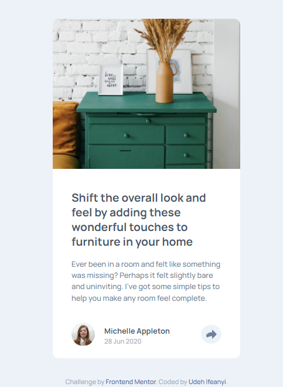
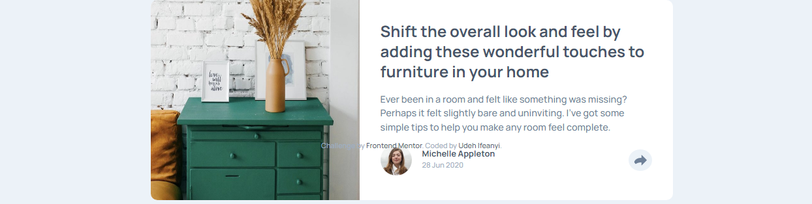

# Frontend Mentor - Article preview component

# Frontend Mentor - Article preview component solution

This is a solution to the [Article preview component challenge on Frontend Mentor](https://www.frontendmentor.io/challenges/article-preview-component-dYBN_pYFT). Frontend Mentor challenges help you improve your coding skills by building realistic projects. 

## Table of contents

- [Overview](#overview)
  - [The challenge](#the-challenge)
  - [Screenshot](#screenshot)
  - [Links](#links)
- [My process](#my-process)
  - [Built with](#built-with)
  - [Continued development](#continued-development)
- [Author](#author)

## Overview

### The challenge

Users should be able to:

- View the optimal layout for the component depending on their device's screen size
- See the social media share links when they click the share icon

### Screenshot

### Links

- Solution URL: [https://github.com/Ifescohub/article-preview](https://github.com/Ifescohub/article-preview)
- Live Site URL: [https://ifescohub.github.io/article-preview/](https://ifescohub.github.io/article-preview/)

## My process

### Built with

- Semantic HTML5 markup
- CSS custom properties
- Flexbox
- Desktop-first workflow
- [Google Fonts](https://fonts.googleapis.com/css2?family=Manrope:wght@500;700&display=swap) - For Fonts

### Continued development

I want to further work on my javascript knowledge.

## Author

- GitHub - [Udeh Ifeanyi](https://github.com/Ifescohub)
- Frontend Mentor - [@ifescohub](https://www.frontendmentor.io/profile/Ifescohub)
- Twitter - [@UdehIfeanyi10](https://twitter.com/UdehIfeanyi10)
